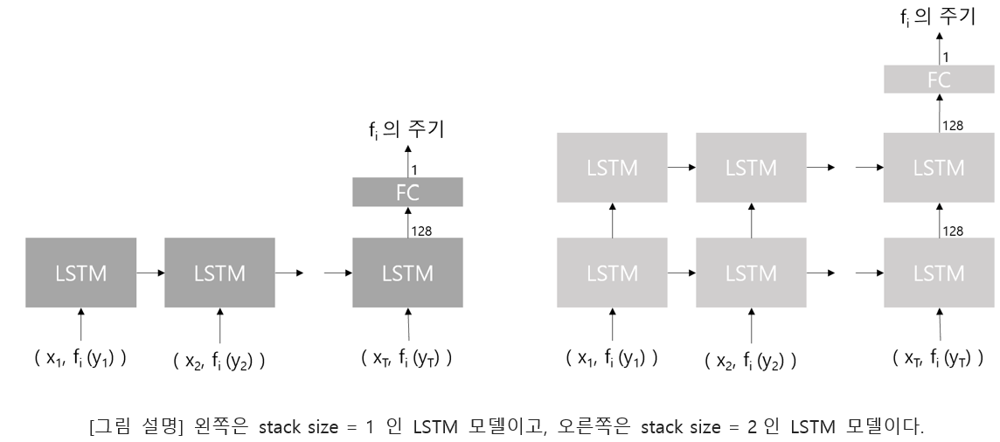

# PROBLEM
To look at the possibility of general function approximation in the neural network, I solved the sine function approximation problem.

Although it is known that any function can be expressed through the neural network by the Universal Function Approximation Theorem, how to determine the hyper-parameter is unknown. Therefore, I tried to find the most accurate neural network by adjusting the width and depth of the neural network layer, and examined the relationship between hyper-parameter and accuracy.

# MODEL
What was difficult about the problem was that a model was needed to predict the y-value for x defined in the infinite range. Since data cannot be made to cover the infinite range, solutions had to be found in the model design.

### LSTM

Performing a task to determine the period of a function.

### MLP

Performing a task to determine the function value f(x) where range of x is [0, period).

# EXPERIMENT

##### LSTM
* Comparison of accuracy with respect to LSTM stack size.
* Analysis of the effect of the number of data points on Accuracy.

##### MLP
* Analysis of the effect of the depth and width of MLP on Accuracy.
* Analysis of the impact of the number of data points on accuracy.
* Analysis of robustness for Biased Data.
